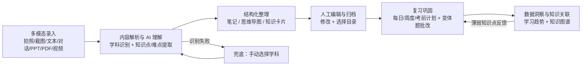
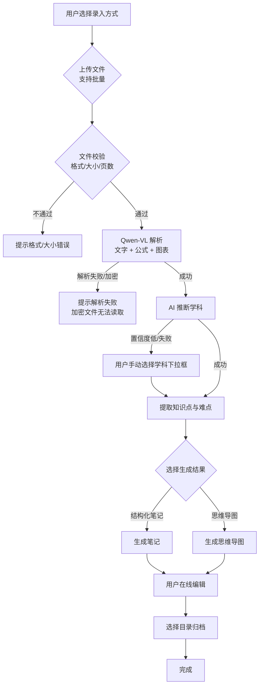
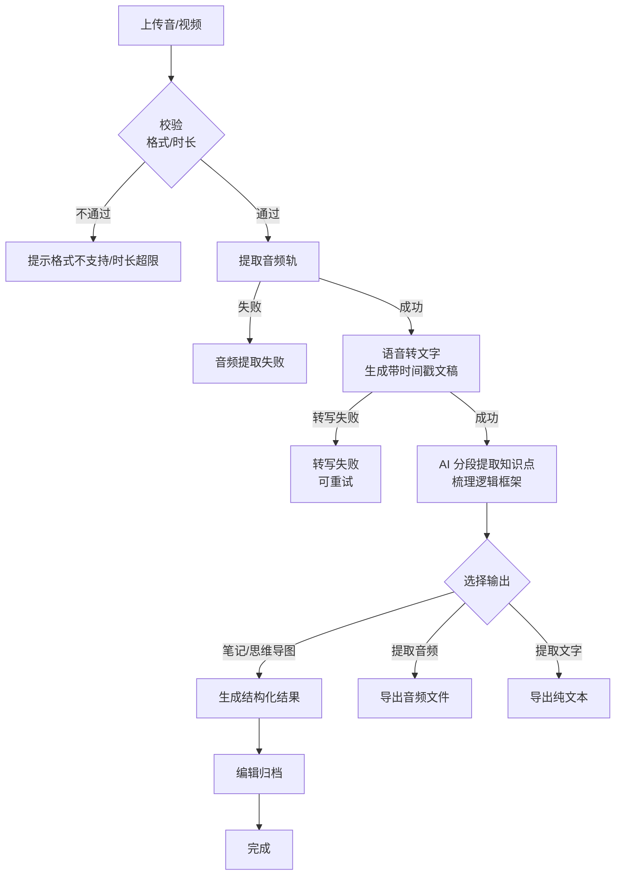
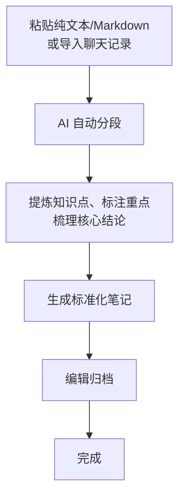

# Clarify - AI 智能笔记整理师 PRD

| 项目 | 内容 |
|------|------|
| 产品名称 | Clarify（AI 智能笔记整理师） |
| 文档版本 | v1.0 |
| 产品定位 | 面向全体学习者的多模态 AI 笔记智能整理工具 |
| 目标形态 | Web 端全栈应用，个人开发者可独立交付 MVP |
| 文档阶段 | 0 到 1 产品定义 |

---

## 1. 产品背景与目标

### 1.1 背景

学习者在记笔记这件事上长期面临一个结构性矛盾：课堂信息是口语化、碎片化、含大量冗余的，而有效复习需要的却是结构化、去噪、可检索的知识。学生被大量时间困在"听讲、抄写、课后再整理"的机械劳动里，真正用于理解和记忆的精力被挤压。[产品判断]

多模态大模型在近两年完成了两项关键跨越：一是视觉理解能力（读懂 PPT 截图、公式、图表）成熟，二是中文语音转写与中文语义理解达到可用水平。这使"把原始材料交给 AI、换取结构化知识"从概念验证进入可交付阶段。[产品判断]

与此同时，个人开发者的成本约束已经松动：通义千问提供新用户免费额度，DeepSeek 以极低单价提供大上下文模型，Supabase 与 Vercel 的免费套餐足以承载 MVP。三者的叠加，让一个小团队用数周时间做出可演示产品变得可行。[产品判断]

### 1.2 目标

**定性目标**

- 建立一条从"任意原始学习材料"到"结构化笔记/思维导图"的自动化通路，覆盖拍照、截图、文本、对话、PPT、PDF、视频七种录入方式。
- 把"区分废话与重点、口语转结构化、归纳知识点与难点、标记考试重点"三件事从人工变为 AI 默认完成、人工可校验修改。

**定量目标（上线后以埋点验证）**

- 完成一篇笔记整理（从录入到归档）的用户操作步数控制在 5 步以内。
- AI 结构化结果直接采纳率（用户不做修改即归档）达到 60% 以上，未达成时优先优化提示词与解析质量而非堆功能。
- 单用户 30 天归档笔记数留存曲线呈正斜率，验证"复习计划 + 变体题"对激活的拉动作用。

### 1.3 不做的事（本期范围外）

- 不提供实时多人协作编辑与共享空间。
- 不做社交化笔记社区与公开课分发。
- 不提供离线端侧模型推理，全部 AI 能力走云端 API。

---

## 2. 目标用户画像

| 角色 | 典型特征 | 使用频率 | 核心痛点 | 核心诉求 |
|------|----------|----------|----------|----------|
| 中学生/高中生 | 学科固定（数理化语英），笔记量大，依赖考试重点 | 每日 | 课堂抄写跟不上，不知道考点在哪 | 提炼考试重点、生成变体题练手 |
| 大学生 | 课程材料多元（PPT、讲义、录音、视频） | 每周多次 | 材料散、复习前要重新翻 | 多格式一键整理、考前复习计划 |
| 备考人群 | 考研/考证，时间紧，需长期复习 | 每日 | 知识点易遗忘，缺乏复习节奏 | 每日/周度复习计划、知识图谱查漏 |
| 终身学习者 | 兴趣驱动，跨学科、碎片时间 | 每周 | 资料零散难沉淀 | 快速归档、语义检索串联 |

四类用户共享一条主线：录入越省事、整理越可靠、复习越自动，付费与留存意愿越高。[产品判断]

---

## 3. 业务核心逻辑

核心业务闭环为"录入 → 理解 → 整理 → 归档 → 复习 → 洞察"，其中"复习产生的新薄弱知识点"回写为下一轮复习计划与变体题的输入，形成正向循环。

---

## 4. 功能流程描述

### 4.1 图片/文档类录入流程（拍照、截图、PPT、PDF）

### 4.2 音/视频录入流程

### 4.3 文本/对话录入流程

---

## 5. 功能需求详情

### 5.1 多模态录入模块

**页面布局**：录入页为单一主操作区，顶部为七种录入方式切换栏（拍照 / 截图 / 文本 / 对话 / PPT / PDF / 视频），中部为上传热区与拖拽区，下方为批量上传文件队列列表。

**业务逻辑**

用户通过点击或拖拽发起录入，系统在文件进入队列前完成格式与大小校验（见字段规则）。校验通过的文件进入上传队列，系统逐项上传并通过进度条反馈；批量模式下允许用户在上传过程中继续追加文件，任一文件失败不影响其余文件，失败项单独标红并给出原因。全部文件上传完成后，系统按"图片/文档类"或"音视频类"分别进入 §5.2 的解析流程。

拍照录入调用设备摄像头，截图录入允许用户粘贴剪贴板图片或选择本地图片。文本录入为纯文本框，接受普通文本与 Markdown；对话录入允许导入聊天记录文本或粘贴对话片段，系统自动识别发言方与发言顺序。

**字段规则**

| 字段 | 类型 | 必填 | 长度/范围 | 默认值 |
|------|------|------|-----------|--------|
| 录入方式 | 枚举 | 是 | 拍照/截图/文本/对话/PPT/PDF/视频 | 最近一次使用的录入方式 |
| 文件 | 文件 | 条件 | 图片 ≤ 10MB；PPT/PDF ≤ 50MB 且页数 ≤ 200 页；音视频 ≤ 500MB 且时长 ≤ 120 分钟 | 无 |
| 文本内容 | 文本 | 条件 | 1 ~ 100,000 字符 | 无 |
| 学科（自动推断失败时） | 下拉框 | 条件 | 数学/物理/化学/语文/英语/生物/历史/地理/政治/其他 | 无 |

**状态变化**

| 当前状态 | 允许操作 | 下一状态 | 触发条件 |
|----------|----------|----------|----------|
| 待上传 | 取消 | 已取消 | 用户在队列中移除 |
| 上传中 | 无 | 解析中 | 上传完成 |
| 上传中 | 无 | 上传失败 | 网络中断或服务端拒绝 |
| 上传失败 | 重试/移除 | 上传中/已取消 | 用户操作 |
| 解析中 | 无 | 待整理 | 解析成功 |
| 解析中 | 无 | 解析失败 | 解析异常 |

### 5.2 内容解析与 AI 理解模块

**业务逻辑**

该模块是产品质量的分水岭。图片/文档类走 Qwen-VL 多模态解析，系统将图片、PPT 页面、PDF 页面逐页送入视觉模型，输出"文字 + 公式 + 图表"的结构化内容；音视频类先提取音频轨，再调用语音转写服务生成带时间戳的逐字稿，随后按语义边界切分段落。

解析完成后，系统自动推断学科，输出学科标签及置信度。当置信度低于阈值或模型返回无法判断时，系统强制呈现一个手动学科选择下拉框，用户必须选择后才能继续，避免错误学科污染后续知识点归纳。推断成功时下拉框仍允许用户主动改选。

学科确定后，AI 以该学科语境提取知识点与难点：知识点以"概念/定理/公式/题型"为粒度输出，难点标注为"理解障碍 + 突破建议"，同时区分"重点/补充/段子"三类内容属性，段子类内容默认折叠但在原文中保留。多页文档按页序分段推理，长视频按时间戳段落分批处理，最终汇总为一棵带层级的主题树。

**交互逻辑（失败兜底）**

- AI 识别失败 → 呈现学科下拉框，用户选择 → 以所选学科重新执行知识点提取。
- 语音转写失败 → 保留原始音频，提示"转写失败，可重试"，不丢弃用户已上传文件。
- 页数超限 → 服务端在解析前拦截，提示剩余可解析页数并建议拆分。

**字段规则**

| 字段 | 类型 | 必填 | 长度/范围 | 默认值 |
|------|------|------|-----------|--------|
| 学科标签 | 枚举 | 是 | 数学/物理/化学/语文/英语/生物/历史/地理/政治/其他 | 自动推断结果 |
| 学科置信度 | 数值 | 是 | 0~1 | 无 |
| 知识点 | 结构化对象 | 是 | 单条 ≥ 1 个知识点 | 无 |
| 难点 | 结构化对象 | 否 | 0~N 条 | 无 |
| 内容属性 | 枚举 | 是 | 重点/补充/段子 | 重点 |
| 时间戳 | 时间戳 | 条件（音视频） | 与逐字稿对齐 | 无 |

### 5.3 结构化整理模块

**业务逻辑**

解析与理解完成后，系统向用户提供两种可选的生成结果：结构化笔记与思维导图，两者共享同一份底层知识点数据，用户可切换查看而无需重新解析。结构化笔记遵循统一模板——标题、学科、知识点分层列表、难点标注、考试重点标记、补充材料引用；思维导图以中心主题为根节点，按学科章节与知识点层级展开，重点与难点以节点样式区分。

知识卡片作为两者之外的第三种轻量产物被自动生成：每个知识点对应一张卡片，卡片包含"知识点名称、一句话定义、关联难点、关联历史笔记"。三种产物均支持后续导出。

**字段规则**

| 字段 | 类型 | 必填 | 范围 | 默认值 |
|------|------|------|------|--------|
| 生成结果形态 | 枚举 | 是 | 结构化笔记/思维导图 | 结构化笔记 |
| 笔记标题 | 文本 | 是 | 1~100 字符 | 来源文件/材料名 |
| 考试重点标记 | 布尔 | 否 | 知识点级 | 由 AI 判定 |
| 知识卡片 | 结构化对象 | 否 | 每知识点一张 | 自动生成 |

### 5.4 人工编辑与归档模块

**业务逻辑**

生成结果默认进入可编辑状态。用户可对笔记正文、标题、知识点条目、难点、重点标记做增删改，编辑采用所见即所得富文本编辑器，支持 Markdown 快捷输入。用户对 AI 生成内容的每一次修改都被记录，用于后续提示词与解析质量的回归评估（统计哪些条目被频繁改写，定位模型系统性偏差）。

归档时用户选择一个目录（默认目录或自定义目录），系统将笔记、备份的思维导图与知识卡片按目录写入数据库，并将知识点与难点的 embedding 写入向量库，生成与该笔记的历史关联索引。归档动作可批量执行，同一批上传文件可一键归档到同一目录。

**交互逻辑**

- 用户点击"归档" → 弹出目录选择器 → 确认 → 系统写入并提示"已归档"，页面跳转至归档目录。
- 用户编辑中断离开 → 系统自动保存草稿（草稿留存 7 天），下次进入提示恢复草稿。

### 5.5 复习巩固模块

**业务逻辑**

算法依据用户的归档记录与知识点掌握状态生成三类计划：每日复习计划（当天应复习的知识点清单，按遗忘曲线排序）、周度复习计划（本周知识覆盖面与薄弱项）、考前复习计划（以目标日期倒推的复习节奏，可按学科切换）。计划中的每个知识点关联一条历史笔记，用户可一键跳转。

AI 变体题生成以"一个知识点 + 题干条件变体"为输入，输出同型不同数据/表述的练习题；用户作答后 AI 批改，返回对错、逐步解析与知识点归因。批改结果计入该知识点的掌握度，失败/未答而非交白卷时，系统按"未作答"单独统计，避免错误计入正确率。

**交互逻辑**

- 用户提交作答为空 → 前端拦截提示"尚未作答"，不发起提交；交卷但存在未作答题 → 系统单独标记，不入正确率分母。

### 5.6 数据洞察模块

**业务逻辑**

数据看板展示学习趋势（近 7 日/30 日新增笔记数、复习完成率、正确率变化、各学科投入时长）与知识图谱。知识图谱以学科为维度，将知识点作为节点、知识点间的关联关系作为边（来源：同源材料共现 + 向量相似度 + 人工关联），用户点击任一节点可查看该知识点的笔记、难题与掌握度，并跳转复习或变体题。

**字段规则**

| 字段 | 类型 | 必填 | 范围 | 默认值 |
|------|------|------|------|--------|
| 时间范围 | 枚举 | 是 | 7 日/30 日/全部 | 30 日 |
| 图谱学科维度 | 枚举 | 否 | 单学科/全部 | 全部 |

### 5.7 导出模块

**业务逻辑**

用户可将单篇笔记或思维导图导出为 PDF 或 Markdown。PDF 导出走前端 @react-pdf/renderer 组件化渲染，支持中文字体与多级标题、重点标记样式；Markdown 导出输出标准 Markdown 文本，思维导图按缩进列表导出。导出内容超限（单次 Markdown 超过 100,000 字符）时系统提示拆分导出。

### 5.8 异常处理矩阵

| 异常类型 | 触发场景 | 处理方式 |
|----------|----------|----------|
| 网络中断 | 上传/解析/提交任一环节断开 | 保留进度与草稿，恢复后断点续传或重试 |
| 空提交 | 编辑页无内容提交归档 | 前端拦截，提示"内容为空，无法归档" |
| 未作答提交 | 交卷含未作答题 | 单独标记，不计入正确率分母 |
| 文件格式/大小校验 | 任一录入类型 | 服务端二次校验，拒绝并给出原因 |
| PPT/PDF 解析失败 | 损坏文件/异常排版 | 提示解析失败，保留原文件 |
| 页数超限 | PDF/PPT > 200 页 | 解析前拦截，建议拆分 |
| 加密文件 | 加密 PDF | 提示"加密文件无法读取"，引导解密后重试 |
| 音视频格式/时长 | 不支持格式或 > 120 分钟 | 提示格式不支持/时长超限 |
| 音频提取/转写失败 | 无声轨/转写服务异常 | 保留原文件，提示重试 |
| 大模型限流/调用失败 | Qwen/DeepSeek 限流或宕机 | 指数退避重试，超时降级为"稍后重试"并告知 |
| 内容合规拦截 | 模型返回合规拒绝 | 明确返回"内容未能通过安全检查"，不伪造结果 |
| 向量存储/检索异常 | embedding 写入失败/检索超时 | 归档降级为仅存正文，检索返回空并提示 |
| 知识点嵌入失败 | 单点 embedding 失败 | 跳过该知识点，不影响整体归档 |
| 用户鉴权失效 | Token 过期 | 跳转登录，保留当前编辑内容 |
| 数据同步失败 | 客户端与服务端不一致 | 以服务端为准，冲突时提示用户选择版本 |
| 存储容量超限 | 超过 1GB 免费额度 | 归档前提示，引导扩容或清理 |
| 文件上传失败 | 服务端拒绝/网络错误 | 队列内标红，支持单独重试 |
| 权限不足 | 访问他人内容 | 返回 403，不暴露数据 |
| PDF 生成失败 | 字体/内存异常 | 提示"导出失败，请重试"，保留笔记数据 |
| Markdown 导出超限 | > 100,000 字符 | 提示拆分导出 |
| 思维导图导出异常 | 图渲染失败 | 降级为缩进列表文本导出 |

---

## 6. 非功能需求

| 指标 | 要求 |
|------|------|
| 普通业务接口（增删改查）响应 | < 300ms |
| AI 流式响应首字 | 主力模型 < 2s，降本模型 < 1s |
| 图片/PDF 识别 + AI 理解 | 单页 < 8s，多页/长视频按时长按比例递增 |
| 首屏加载 | < 2s（Next.js SSR/SSG 优化） |
| 向量检索响应 | < 500ms |
| PDF 导出 | 单篇笔记 < 3s |
| 知识容量 | 单用户 ≥ 10,000 条知识条目（笔记 + 知识卡片） |
| 数据持久化 | Supabase 云端持久化存储，支持离线缓存（可选） |
| 存储方式 | 本地存储（草稿、偏好设置等非核心数据）+ 云端主库 |
| 兼容性 | 主流浏览器（Chrome/Safari/Edge/Firefox 最近两个大版本） |
| 适配性 | 响应式布局，移动端与桌面端均可正常使用 |

---

## 7. 验收标准（GIVEN-WHEN-THEN）

### 7.1 多模态录入

- **GIVEN** 用户进入录入页 **WHEN** 上传一个 15MB 的 PPT **THEN** 系统在解析前拦截并提示"文件超过 10MB/50MB 限制"，不进入解析。
- **GIVEN** 用户批量上传 5 个文件，其中 1 个格式不支持 **WHEN** 上传结束 **THEN** 系统对 4 个合法文件正常解析，1 个非法文件单独标红并给出原因。

### 7.2 学科识别与兜底

- **GIVEN** 用户上传一张物理试卷截图 **WHEN** AI 返回学科置信度低于阈值 **THEN** 系统强制展示学科下拉框，用户选择"物理"后继续知识点提取。
- **GIVEN** AI 成功识别学科为数学 **WHEN** 用户主动将下拉框改为"物理" **THEN** 系统以"物理"语境重新执行知识点提取。

### 7.3 结构化整理

- **GIVEN** 解析完成 **WHEN** 用户切换"结构化笔记/思维导图" **THEN** 系统基于同一份底层知识点数据即时切换视图，不重新解析。
- **GIVEN** AI 生成笔记 **WHEN** 用户修改标题与某条知识点后归档 **THEN** 修改内容被持久化，原始 AI 输出与用户修改差异被记录。

### 7.4 音视频处理

- **GIVEN** 用户上传 60 分钟课程视频 **WHEN** 提取音频轨并转写 **THEN** 系统生成带时间戳逐字稿，并按语义分段提取知识点。
- **GIVEN** 用户选择"提取文字" **WHEN** 转写完成 **THEN** 系统导出纯文本文件，不含 AI 整理内容。

### 7.5 复习巩固

- **GIVEN** 用户提交含 1 道未作答题的练习 **WHEN** 交卷 **THEN** 系统将未作答题单独标记，正确率分母剔除该题。
- **GIVEN** 用户点击"生成变体题" **WHEN** AI 返回同知识点不同数据的题目 **THEN** 系统展示原题与变体题对照，并支持在线作答。

### 7.6 数据洞察

- **GIVEN** 用户归档 10 篇笔记 **WHEN** 打开知识图谱 **THEN** 系统展示知识点节点及同源共现/相似度边，可点击节点跳转笔记与变体题。

### 7.7 导出

- **GIVEN** 用户导出单篇笔记为 PDF **WHEN** 点击导出 **THEN** 3 秒内生成含中文字体与重点标记的 PDF 文件。
- **GIVEN** 用户导出 Markdown 且内容 120,000 字符 **WHEN** 点击导出 **THEN** 系统提示"内容超限，请拆分导出"，不生成损坏文件。

### 7.8 异常处理

- **GIVEN** 大模型接口限流 **WHEN** 首次调用失败 **THEN** 系统指数退避重试，仍失败时提示"稍后重试"，不返回伪造笔记。
- **GIVEN** 用户 Token 过期 **WHEN** 发起归档请求 **THEN** 系统跳转登录页并保留当前编辑内容，登录后恢复。
- **GIVEN** embedding 写入失败 **WHEN** 归档 **THEN** 系统降级为仅保存正文，检索返回空并给出可读提示，不影响归档成功。

---

## 8. 技术方案概要

| 层级 | 选型 | 职责 |
|------|------|------|
| 前端框架 | Next.js 15 | SSR/SSG 首屏优化、页面路由、富文本编辑界面 |
| 后端框架 | Next.js API Routes | 业务接口、AI 调用编排、流式响应、文件上传代理 |
| 业务数据库 | Supabase (PostgreSQL) | 用户、笔记、目录、复习计划、批改记录 |
| 认证与存储 | Supabase Auth + Storage | 登录鉴权、文件与音视频存储 |
| 向量数据库 | Supabase Vector (pgvector) | 知识点/笔记 embedding 存储与语义检索、知识关联 |
| 主力模型 | Qwen3-Max | 中文笔记结构化、知识点/难点提取、变体题生成与批改 |
| 降本模型 | DeepSeek-V4-Flash | 长文本分批处理、批量任务、低成本兜底 |
| 多模态模型 | Qwen-VL | PPT/截图/PDF 的视觉解析、公式与图表识别 |
| 语音转写 | 语音转文字服务（与 ASR 流程对接） | 音视频轨转带时间戳逐字稿 |
| PDF 生成 | @react-pdf/renderer | 前端组件化生成笔记/思维导图 PDF |
| 部署 | Vercel（前端 + API）+ Supabase（数据） | MVP 免费额度，零运维 |

**AI 调用的统一抽象**：所有模型（Qwen3-Max / DeepSeek-V4-Flash / Qwen-VL）走同一 OpenAI 兼容接口层，以配置项切换模型与降级策略，避免业务代码与具体模型耦合，便于成本控制与后续升级。