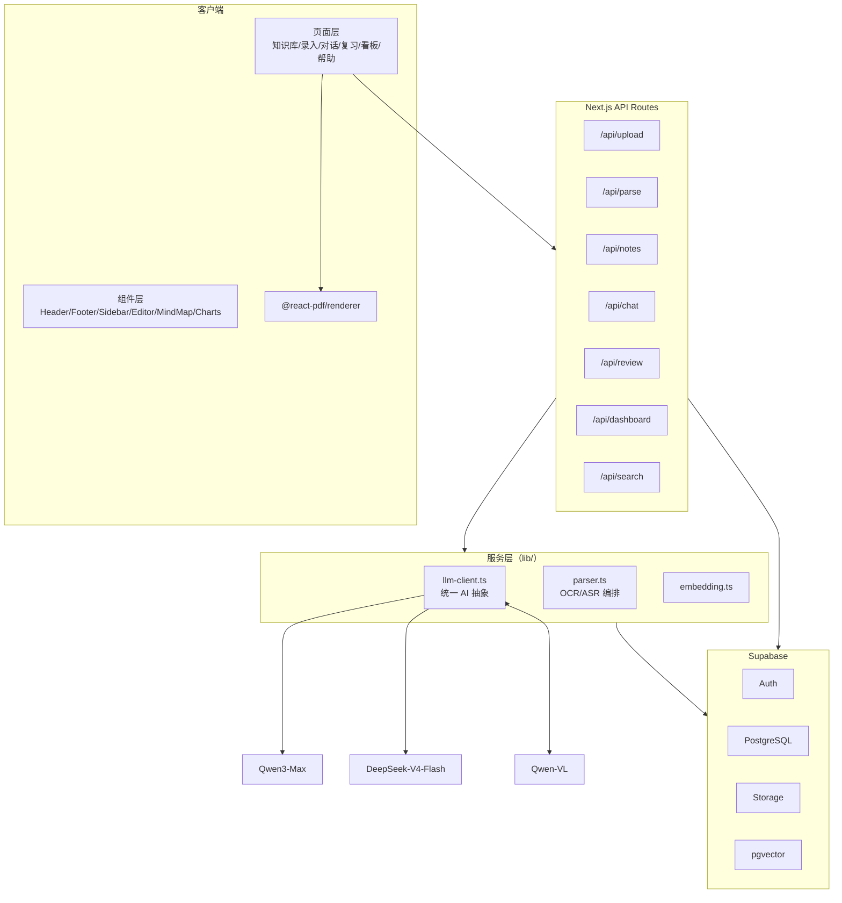
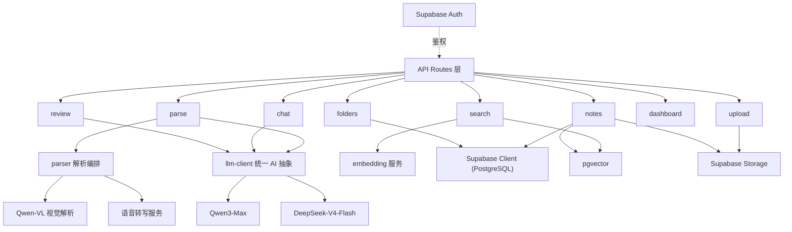

# Clarify - AI 智能笔记整理师 开发规划文档

| 项目 | 内容 |
|------|------|
| 文档版本 | v1.0 |
| 文档类型 | 开发规划文档 |
| 上游文档 | PRD v1.0、产品设计文档 v1.0 |
| 适用团队 | 个人开发者 / 单兵作战 |
| 技术栈 | Next.js 15 + Next.js API Routes + Supabase + pgvector + Qwen3-Max / DeepSeek-V4-Flash / Qwen-VL + @react-pdf/renderer |

---

## 一、开发总纲

### 1.1 目标

在 6 周内交付可演示的 MVP，覆盖 PRD 定义的六条业务主线：多模态录入、内容解析与 AI 理解、结构化整理、编辑归档、复习巩固、数据洞察。所有 AI 能力走云端 API，零端侧模型推理，零独立服务器运维。

### 1.2 核心原则

| 原则 | 落地要求 |
|------|----------|
| 全栈一体 | 前后端同仓库、同语言（TypeScript），不引入独立后端服务 |
| 统一 AI 抽象 | Qwen3-Max / DeepSeek-V4-Flash / Qwen-VL 走同一 OpenAI 兼容接口层，模型切换只改配置不改业务代码 |
| 异步优先 | 超过 Vercel 函数超时阈值（Hobby 10s）的任务一律异步化 + 轮询，不阻塞主流程 |
| 数据合一 | 业务数据与向量同库（Supabase + pgvector），SQL JOIN 关联，不引入独立向量服务 |
| 降级兜底 | 每个 AI 环节均有失败兜底，AI 失败不丢失用户已输入内容 |
| Token 化 | 严格按设计文档 Token 落地，无硬编码色值、字号、间距 |

### 1.3 技术架构



### 1.4 目录结构（约定）

```text
clarify/
├── app/                          # Next.js App Router 页面
│   ├── (auth)/                   # 登录/注册
│   ├── (main)/
│   │   ├── library/              # 知识库主页
│   │   ├── ingest/               # 多模态录入
│   │   ├── chat/                 # AI 对话助手
│   │   ├── review/               # 复习中心（含三级流程）
│   │   ├── dashboard/            # 数据看板
│   │   └── help/                 # 帮助中心
│   └── api/                      # API Routes
├── components/                   # 通用组件
│   ├── ui/                       # 基础 UI（按钮/输入框/卡片）
│   ├── layout/                   # Header/Footer/Sidebar
│   ├── editor/                   # 富文本编辑器
│   └── mindmap/                  # 思维导图
├── lib/                          # 服务层
│   ├── supabase/                 # Supabase 客户端封装
│   ├── llm/                      # AI 统一抽象
│   ├── parser/                   # 解析编排
│   └── export/                   # 导出逻辑
├── types/                        # 全局类型定义
├── config/                       # 环境变量与配置
└── docs/                         # 文档
```

---

## 二、里程碑与任务分解

### 2.1 里程碑总览

| 里程碑 | 周期 | 目标 | 里程碑出口 |
|--------|------|------|-----------|
| M0 基础架构 | 第 1 周 | 跑通工程骨架与基础设施 | 登录后可见空知识库主页 |
| M1 核心闭环 | 第 2~3 周 | 图/文录入 → 解析 → 生成 → 编辑 → 归档全打通 | 一篇文章从拍照到归档可演示 |
| M2 知识库与检索 | 第 3~4 周 | 目录、笔记列表、语义检索、思维导图 | 知识库可管理 + 关联推荐可用 |
| M3 复习与对话 | 第 4~5 周 | 复习计划、变体题批改、AI 对话 | 完成一轮"复习 → 批改"闭环 |
| M4 洞察与打磨 | 第 5~6 周 | 数据看板、导出、异常兜底、上线 | 可演示 MVP 部署上线 |

### 2.2 任务分解

#### M0 基础架构（第 1 周）

| 编号 | 任务 | 优先级 | 产出物 |
|------|------|--------|--------|
| M0-1 | Next.js 15 项目初始化，接入 TypeScript 严格模式、ESLint、Prettier | P0 | 可构建的项目骨架 |
| M0-2 | 配置设计 Token（Tailwind 主题映射，含色值/字号/间距/圆角变量） | P0 | `tailwind.config` + CSS 变量 |
| M0-3 | 创建 Supabase 项目，建表 + RLS 策略 + 开启 Auth | P0 | 数据库 Schema 迁移脚本 |
| M0-4 | 封装 Supabase 客户端（服务端/浏览器端双实例） | P0 | `lib/supabase` |
| M0-5 | 实现通用 Header / Footer / 登录注册页 | P0 | 通用布局组件 |
| M0-6 | 搭建页面路由骨架（6 个页面空壳 + 布局模式） | P1 | 可导航的空页面 |

#### M1 核心闭环（第 2~3 周）

| 编号 | 任务 | 优先级 | 产出物 |
|------|------|--------|--------|
| M1-1 | 统一 AI 抽象层（OpenAI 兼容 client，支持模型路由 + 流式 + 降级） | P0 | `lib/llm` |
| M1-2 | 文件上传模块（直传 Supabase Storage + 前端校验 + 队列） | P0 | `/api/upload` + 录入页上传区 |
| M1-3 | 图片/文本解析（Qwen-VL + Qwen3-Max），学科推断 + 手动兜底 | P0 | `/api/parse` |
| M1-4 | 知识点/难点提取提示词工程 + 结构化 Schema 校验 | P0 | AI 输出解析器 |
| M1-5 | 笔记生成（结构化笔记渲染 + 重点/难点左边框样式） | P0 | 笔记编辑页 |
| M1-6 | 富文本编辑器（Markdown 快捷输入 + 全量可编辑） | P0 | `components/editor` |
| M1-7 | 归档流程（目录选择 + 入库 + embedding 写入 + 降级） | P0 | `/api/notes/archive` |
| M1-8 | PPT/PDF 解析（Qwen-VL 多页 + 页数校验） | P1 | 解析器扩展 |

#### M2 知识库与检索（第 3~4 周）

| 编号 | 任务 | 优先级 | 产出物 |
|------|------|--------|--------|
| M2-1 | 目录树（增删改 + 展开折叠 + 8 色标签） | P0 | `/api/folders` + 侧边栏 |
| M2-2 | 笔记列表（倒序 + 无限滚动 + 骨架屏 + 多选批量） | P0 | `/api/notes` |
| M2-3 | 语义检索（pgvector 相似度 + 关联笔记推荐） | P0 | `/api/search` |
| M2-4 | 思维导图视图（画布渲染 + 缩放拖拽 + 节点样式） | P0 | `components/mindmap` |
| M2-5 | 知识卡片生成与展示 | P1 | 卡片组件 |
| M2-6 | 版本历史 + 自动保存草稿 | P1 | 草稿/版本逻辑 |

#### M3 复习与对话（第 4~5 周）

| 编号 | 任务 | 优先级 | 产出物 |
|------|------|--------|--------|
| M3-1 | 复习计划生成（每日/周度/考前 + 遗忘曲线排序 + 学科切换） | P0 | `/api/review/plans` |
| M3-2 | 变体题生成（知识点 + 题干变体，走降本模型） | P0 | `/api/review/generate` |
| M3-3 | 批改判分（对错 + 解析 + 知识点归因 + 未作答剔除） | P0 | `/api/review/grade` |
| M3-4 | 复习三阶段界面（模式选择 → 作答 → 批改详情） | P0 | 复习中心页 |
| M3-5 | AI 对话（流式 SSE + 消息流 + 一键转笔记） | P0 | `/api/chat` |
| M3-6 | 音/视频录入（音频轨提取 + ASR + 分段理解 + 提取音频/文字） | P1 | 异步任务 + `/api/parse` 扩展 |

#### M4 洞察与打磨（第 5~6 周）

| 编号 | 任务 | 优先级 | 产出物 |
|------|------|--------|--------|
| M4-1 | 数据看板（趋势折线 + 掌握度环形 + 薄弱点 + 知识图谱） | P0 | `/api/dashboard` |
| M4-2 | 导出（Markdown + @react-pdf/renderer PDF + 超限拦截） | P0 | 导出模块 |
| M4-3 | 异常兜底完整版（空状态/加载/错误提示全场景） | P0 | 全局异常组件 |
| M4-4 | 响应式三端适配（PC/平板/移动） | P1 | 断点样式 |
| M4-5 | 埋点（笔记整理步数、AI 采纳率、30 天留存） | P2 | 埋点事件 |
| M4-6 | 部署 Vercel + 域名 + 基础监控 | P0 | 可访问 URL |

---

## 三、组件/模块依赖树

### 3.1 前端组件依赖

```mermaid
flowchart TD
    App["App 根布局"] --> Header["CommonHeader 通用 Header"]
    App --> Footer["CommonFooter 通用 Footer"]
    App --> Pages["页面层"]

    Pages --> Library["知识库主页"]
    Pages --> Ingest["录入页"]
    Pages --> Chat["对话页"]
    Pages --> Review["复习中心"]
    Pages --> Dash["数据看板"]
    Pages --> Help["帮助中心"]

    Header --> Logo["Logo"]
    Header --> SearchBox["GlobalSearchBox 全局搜索"]
    Header --> NewBtn["NewNoteButton 新建笔记"]
    Header --> Avatar["UserAvatar 头像"]

    Library --> Sidebar["LibrarySidebar 侧边栏"]
    Library --> NoteView["NoteView 笔记视图"]
    Library --> MindMapView["MindMapView 思维导图视图"]
    Library --> EditBar["AutoSaveBar 自动保存栏"]

    Sidebar --> FolderTree["FolderTree 目录树"]
    Sidebar --> NoteList["NoteList 笔记列表"]
    Sidebar --> UserInfo["UserInfo 用户信息"]

    NoteView --> Editor["RichTextEditor 富文本编辑器"]
    NoteView --> KPCard["KnowledgePointCard 知识点卡片"]
    NoteView --> DiffArea["DifficultyArea 难点标注区"]
    NoteView --> FilterBar["FilterBar 筛选栏"]

    MindMapView --> MindMap["MindMapCanvas 思维导图画布"]

    Ingest --> TabBar["IngestTabBar 录入方式 Tab"]
    Ingest --> UploadZone["UploadZone 拖拽上传热区"]
    Ingest --> FileQueue["FileQueue 上传队列"]
    Ingest --> ParseBtn["ParseButton 开始解析"]

    Chat --> SessionList["SessionList 会话列表"]
    Chat --> MessageFlow["MessageFlow 消息流"]
    Chat --> ChatInput["ChatInput 输入框"]

    Review --> ModePicker["ModePicker 模式选择卡片"]
    Review --> QuizCard["QuizCard 答题卡"]
    Review --> ResultSummary["ResultSummary 批改总览"]
    Review --> AnswerDetail["AnswerDetail 逐题详情"]

    Dash --> TrendChart["TrendChart 趋势折线图"]
    Dash --> MasteryRing["MasteryRing 掌握度环形图"]
    Dash --> WeakList["WeakPointList 薄弱点列表"]
    Dash --> KnowledgeGraph["KnowledgeGraph 知识图谱"]

    Common["基础 UI 层"] --> Button
    Common --> Input
    Common --> Card
    Common --> Skeleton
    Common --> Modal
    Common --> ColorPicker["TagColorPicker 标签颜色选择"]

    NoteList --> Skeleton
    FolderTree --> Common
    Editor --> Button
    QuizCard --> Input
```



### 3.2 后端服务依赖



### 3.3 依赖约束

- 页面层只依赖组件层与 API client，不直接 import `lib/llm`。
- `lib/llm` 是唯一 AI 调用入口，业务模块不得绕过它直连模型 SDK。
- `lib/supabase` 是唯一数据库/存储入口，禁止在组件内散落 `createClient`。
- 基础 UI 层不依赖任何业务模块，保持可复用。

---

## 四、API 契约

### 4.1 约定

- 基础路径：`/api`
- 认证：Supabase Auth 的 `Authorization: Bearer <access_token>`（由 `@supabase/ssr` 自动注入）。
- 响应封装：成功 `{ data: T }`，失败 `{ error: { code, message } }`，HTTP 状态码语义化（400 参数、401 未登录、403 无权限、429 限流、500 服务）。
- 流式接口：`Content-Type: text/event-stream`，以 SSE 推送增量。
- 长任务：返回 `{ data: { jobId } }`，客户端轮询 `GET /api/jobs/:jobId` 获取状态。
- 分页：`?cursor=<游标>&limit=<n>`，返回 `{ data, nextCursor }`。

### 4.2 核心数据模型（契约前置）

| 表 | 关键字段 | 说明 |
|----|----------|------|
| folders | id, user_id, name, color, parent_id | 目录（8 色标签） |
| notes | id, user_id, folder_id, title, subject, content, view_type, status | 笔记（content 存结构化 JSON） |
| knowledge_points | id, note_id, title, definition, kind, important | 知识点（kind: 重点/难点/冗余） |
| note_embeddings | id, note_id, kp_id, embedding vector(1536) | 向量（pgvector） |
| review_plans | id, user_id, type, subject, items | 复习计划 |
| quizzes | id, kp_id, question, answer, explanation, variant | 变体题 |
| quiz_attempts | id, quiz_id, user_answer, is_correct, status | 作答记录 |
| conversations | id, user_id, title | 对话会话 |
| messages | id, conversation_id, role, content | 对话消息 |

### 4.3 接口清单

#### 认证（走 Supabase SDK，无自建 API）

由 `@supabase/ssr` 直接处理登录/注册/登出/会话刷新，前端不通过 API Routes 中转。

#### 上传与解析

| 方法 | 路径 | 请求 | 响应 | 说明 |
|------|------|------|------|------|
| POST | `/api/upload` | `{ fileName, fileType, size }` | `{ uploadUrl, fileKey }` | 生成预签名上传地址，前端直传 Storage |
| POST | `/api/parse` | `{ fileKeys[], mode, subject? }` | `{ jobId }` | 提交解析任务，按 mode 分发图/文/音视频 |
| GET | `/api/jobs/:jobId` | - | `{ status, result? }` | 查询异步任务状态（pending/running/done/failed） |
| POST | `/api/parse/text` | `{ text, subject? }` | `{ data }` | 文本/对话录入同步解析，流式返回 |

#### 笔记与目录

| 方法 | 路径 | 请求 | 响应 | 说明 |
|------|------|------|------|------|
| GET | `/api/notes` | `?folderId=&subject=&keyword=&cursor=&limit=` | `{ data, nextCursor }` | 笔记列表，倒序 + 多条件筛选 + 无限滚动 |
| GET | `/api/notes/:id` | - | `{ data }` | 笔记详情（含知识点、难点） |
| POST | `/api/notes` | `{ title, content, subject, folderId }` | `{ data }` | 保存草稿/新建 |
| PATCH | `/api/notes/:id` | 部分字段 | `{ data }` | 编辑更新 |
| DELETE | `/api/notes/:id` | - | `{ data }` | 删除 |
| POST | `/api/notes/:id/archive` | `{ folderId }` | `{ data }` | 归档（写入 embedding，失败降级仅存正文） |
| POST | `/api/notes/batch` | `{ ids[], action }` | `{ data }` | 批量归档/移动/导出（action: archive/move/export） |
| GET | `/api/folders` | - | `{ data }` | 目录树 |
| POST | `/api/folders` | `{ name, color, parentId? }` | `{ data }` | 新建目录 |
| PATCH | `/api/folders/:id` | `{ name?, color? }` | `{ data }` | 重命名/改色 |
| DELETE | `/api/folders/:id` | - | `{ data }` | 删除目录 |

#### 搜索

| 方法 | 路径 | 请求 | 响应 | 说明 |
|------|------|------|------|------|
| GET | `/api/search` | `?keyword=&cursor=` | `{ data, nextCursor }` | 关键词搜索（FTS） |
| GET | `/api/search/semantic` | `?query=` | `{ data }` | 语义检索（pgvector，返回关联笔记 + 相似度） |

#### 对话助手

| 方法 | 路径 | 请求 | 响应 | 说明 |
|------|------|------|------|------|
| GET | `/api/chat/conversations` | - | `{ data, nextCursor }` | 会话列表 |
| POST | `/api/chat` | `{ conversationId?, message }` | SSE 流 | 发起对话，流式返回 |
| POST | `/api/chat/:id/note` | - | `{ data }` | 对话一键转笔记 |
| DELETE | `/api/chat/conversations` | - | `{ data }` | 清空历史 |

#### 复习

| 方法 | 路径 | 请求 | 响应 | 说明 |
|------|------|------|------|------|
| POST | `/api/review/plans` | `{ type, subject?, targetDate? }` | `{ data }` | 生成复习计划（daily/weekly/exam） |
| GET | `/api/review/plans/:id` | - | `{ data }` | 计划详情 |
| POST | `/api/review/quiz/generate` | `{ kpId }` | `{ data }` | 生成变体题 |
| POST | `/api/review/quiz/grade` | `{ quizId, answers[] }` | `{ data }` | 批改（对错 + 解析 + 未作答剔除） |

#### 洞察与导出

| 方法 | 路径 | 请求 | 响应 | 说明 |
|------|------|------|------|------|
| GET | `/api/dashboard/trend` | `?range=7d|30d|all&subject=` | `{ data }` | 学习趋势（笔记数、复习完成率） |
| GET | `/api/dashboard/mastery` | `?subject=` | `{ data }` | 掌握度（按学科聚合） |
| GET | `/api/dashboard/weak-points` | `?limit=` | `{ data }` | 薄弱知识点排序 |
| GET | `/api/dashboard/graph` | `?subject=` | `{ data }` | 知识图谱（节点 + 边） |
| POST | `/api/export/markdown` | `{ noteId }` | `{ content }` | Markdown 导出（>10 万字符返回超限错误） |

> PDF 导出走前端 `@react-pdf/renderer`，无后端接口。

### 4.4 关键契约示例

**POST /api/parse（异步）响应**

```json
{
  "data": { "jobId": "job_abc123" }
}
```

**GET /api/jobs/:jobId 响应**

```json
{
  "data": {
    "jobId": "job_abc123",
    "status": "running",
    "progress": { "current": 3, "total": 20 }
  }
}
```

```json
{
  "data": {
    "jobId": "job_abc123",
    "status": "done",
    "result": {
      "subject": "数学",
      "confidence": 0.87,
      "knowledgePoints": [
        { "title": "函数的定义", "kind": "focus", "summary": "..." }
      ],
      "difficulties": [
        { "title": "极限计算", "summary": "...", "suggestion": "..." }
      ]
    }
  }
}
```

**POST /api/chat（SSE）事件流**

```
event: delta
data: {"content": "极限计算"}

event: delta
data: {"content": "常用方法"}

event: done
data: {"conversationId": "conv_123", "messageId": "msg_456"}
```

---

## 五、开发规范

### 5.1 代码规范

| 维度 | 规范 |
|------|------|
| 语言 | TypeScript，开启 `strict: true`，禁用 `any`（确需遮蔽时加注释说明） |
| 组件 | 纯函数组件，业务逻辑抽 hook（`useXxx`），UI 组件不写数据请求 |
| 命名 | 组件 PascalCase，文件 kebab-case，函数 camelCase，常量 UPPER_SNAKE_CASE |
| 服务端/客户端 | 显式使用 `'use server'` / `'use client'`，避免隐式混用 |
| 提交信息 | 遵循 Conventional Commits：`feat / fix / refactor / docs / chore` + 简短描述 |
| 包管理 | 统一使用 npm，锁定 `package-lock.json` |
| 格式化 | Prettier + ESLint，提交前自动检查 |

### 5.2 设计 Token 落地

- 在 Tailwind 主题中定义语义变量：`color-primary`、`color-bg`、`color-card`、`color-border`、`color-ink-1/2/3`、`color-success/warning/error`。
- 间距一律用 `xs/sm/md/lg/xl/2xl/3xl` 语义 token，禁止出现非 8 倍数的任意值。
- 圆角通过 `rounded-btn/rounded-card/rounded-tag/rounded-modal` 四档语义类。
- 无阴影策略：全局禁用 `shadow-*`，层级靠 `border` + 留白区分；Hover 色值 `#C8C3E0` 单独定义为 `color-border-hover`。
- 中文字体栈保持一致，禁止页面级覆盖字体。

### 5.3 数据库规范

| 规范项 | 要求 |
|--------|------|
| 表命名 | 复数 snake_case（`knowledge_points`），字段 snake_case |
| RLS | 所有用户数据表强制 RLS，策略基于 `auth.uid() = user_id` 隔离 |
| 迁移 | 用 SQL 迁移脚本管理，禁止在生产表手工改结构 |
| 向量 | `note_embeddings` 建 HNSW 索引，`vector_cosine_ops`，维度 1536 |
| 索引 | `notes(user_id, updated_at)`、`folders(user_id, parent_id)`、`knowledge_points(note_id)` 建复合索引 |
| 软删除 | 删除操作优先 `is_deleted` 标记，硬删除留到清理任务 |

### 5.4 AI 统一抽象规范

```typescript
// lib/llm/types.ts（示意）
type ModelName = 'qwen3-max' | 'deepseek-v4-flash' | 'qwen-vl';

interface LLMCallParams {
  model: ModelName;
  system: string;
  messages: Message[];
  stream?: boolean;
  jsonMode?: boolean;        // 结构化输出
  temperature?: number;
}

interface LLMClient {
  chat(params: LLMCallParams): Promise<ChatResult>;
  chatStream(params: LLMCallParams): AsyncIterable<Chunk>;
  embed(text: string): Promise<number[]>;   // 走统一 embedding 端点
}
```

- 模型路由策略：结构化笔记整理、变体题生成走 `qwen3-max`；长文本分批、批量降本走 `deepseek-v4-flash`；图片/文档解析走 `qwen-vl`。
- 重试规则：限流/5xx 指数退避重试 3 次，仍失败向上抛业务错误并降级。
- 所有模型输出先经 JSON Schema 校验，校验失败重试一次，二次失败走降级路径。

### 5.5 异步长任务规范

- 判定标准：预计运行 > 8s 的任务（音视频转写、多页 PDF/PPT 解析）必须走异步 job。
- Job 状态存 Supabase 表 `jobs(id, user_id, type, status, result, error, created_at)`。
- 前端 `POST` 提交 → 拿 `jobId` → 每 2s 轮询 `/api/jobs/:jobId` → 终态后停止。
- AI 实际执行放在 Supabase Edge Function 或具备长运行能力的位置，避免阻塞 Vercel 函数超时。

### 5.6 错误与状态码规范

| 错误码 | HTTP | 场景 |
|--------|------|------|
| `BAD_REQUEST` | 400 | 参数缺失、文件非法 |
| `UNAUTHORIZED` | 401 | 未登录 / Token 过期 |
| `FORBIDDEN` | 403 | 访问他人资源 |
| `NOT_FOUND` | 404 | 资源不存在 |
| `RATE_LIMITED` | 429 | AI 限流 |
| `PAYLOAD_TOO_LARGE` | 413 | 文件超限 |
| `INTERNAL` | 500 | 未预期错误 |

---

## 六、风险矩阵

| 风险 | 类别 | 概率 | 影响 | 应对策略 |
|------|------|------|------|----------|
| Vercel Hobby 函数 10s 超时，AI 长任务被中断 | 技术 | 高 | 高 | 异步 job + 轮询；单页/短文本走流式，音视频/多页走异步 |
| Vercel Hobby 仅限非商业用途 | 合规 | 中 | 中 | MVP 阶段用于演示验证；商业化前升级 Pro 或迁移 |
| Supabase 免费项目 1 周无活动暂停 | 技术 | 中 | 中 | 部署后配置定期唤醒（cron ping），文档提示 |
| Qwen/DeepSeek 接口限流或故障 | 技术 | 中 | 高 | 指数退避重试 + 双模型互备降级 + 前端"稍后重试"提示 |
| AI 中文结构化输出不稳定（知识点/难点格式漂移） | 产品 | 中 | 高 | JSON Schema 强校验 + 单次重试 + 失败保留原文不丢数据 |
| 学科误判导致归纳偏差 | 产品 | 中 | 中 | 置信度阈值 + 手动选择兜底 + 允许主动改选 |
| 音视频转写成本高、链路长 | 成本 | 中 | 中 | 时长上限 120 分钟；转写走按量服务；MVP 优先图/文，音视频 P1 |
| OCR 视觉识别准确率不足（公式/图表） | 技术 | 中 | 中 | Qwen-VL 主用；结果全量可编辑，用户可修正 |
| pgvector 数据量增长后检索性能下降 | 技术 | 低 | 中 | HNSW 索引；单用户 < 1 万条目内无压力；超量再分库 |
| 单兵精力分散，范围蔓延 | 资源 | 高 | 高 | 严格按 M0~M4 排序，非 P0 一律靠后；定义明确的 MVP 边界 |
| @react-pdf/renderer 中文字体渲染异常 | 技术 | 低 | 中 | 提前注册中文字体；异常降级为 Markdown 导出 |
| 数据安全（RLS 配置错误导致越权） | 安全 | 中 | 高 | RLS 全覆盖 + 测试用例验证跨用户隔离 |

---

## 七、验收标准

以下验收标准从开发侧验证 MVP 是否达到 PRD 与设计文档要求，按功能域组织。

### 7.1 多模态录入

- **GIVEN** 用户进入录入页并上传一个 15MB 的 PPT **WHEN** 文件进入队列 **THEN** 前端在解析前拦截，标红并提示超过大小限制，不发起上传。
- **GIVEN** 用户批量上传 5 个文件，其中 1 个格式不支持 **WHEN** 上传结束 **THEN** 合法文件正常上传，非法文件单独标红并可删除。
- **GIVEN** 用户拖拽文件至录入热区 **WHEN** 松开鼠标 **THEN** 热区边框变主紫并立即开始上传。

### 7.2 内容解析与学科识别

- **GIVEN** 上传一张物理试卷截图 **WHEN** AI 返回置信度低于阈值 **THEN** 强制展示学科下拉框，选择后继续提取。
- **GIVEN** AI 识别学科为数学 **WHEN** 用户手动改为物理 **THEN** 系统以物理语境重新提取知识点。

### 7.3 结构化整理与归档

- **GIVEN** 解析完成 **WHEN** 用户切换笔记/思维导图视图 **THEN** 基于同一份数据即时切换，不重新解析。
- **GIVEN** 用户编辑标题与知识点并归档 **WHEN** 归档成功 **THEN** 修改内容持久化，embedding 写入成功（或触发降级仅存正文）。
- **GIVEN** embedding 写入失败 **WHEN** 归档 **THEN** 归档仍成功，检索返回空并给可读提示。

### 7.4 复习巩固

- **GIVEN** 用户提交含 1 道未作答题的练习 **WHEN** 交卷 **THEN** 未作答题单独标记，不计入正确率分母。
- **GIVEN** 用户点击生成变体题 **WHEN** AI 返回同知识点题目 **THEN** 展示原题/变体题并支持在线作答。

### 7.5 数据洞察

- **GIVEN** 用户归档 10 篇笔记 **WHEN** 打开知识图谱 **THEN** 展示知识点节点与关联边，点击节点跳转笔记。

### 7.6 导出

- **GIVEN** 导出单篇笔记为 PDF **WHEN** 点击导出 **THEN** 3 秒内生成含中文字体与重点标记的 PDF。
- **GIVEN** 导出 Markdown 且内容 120,000 字符 **WHEN** 点击导出 **THEN** 提示超限，不生成损坏文件。

### 7.7 非功能指标

| 指标 | 验收阈值 | 验证方式 |
|------|----------|----------|
| 普通业务接口响应 | < 300ms | 压测与埋点 |
| AI 流式首字 | 主力 < 2s，降本 < 1s | 流式计时 |
| 单页识别 + 理解 | < 8s | 计时埋点 |
| 首屏加载 | < 2s | Lighthouse |
| 向量检索 | < 500ms | 接口计时 |
| 单篇 PDF 导出 | < 3s | 计时 |

### 7.8 安全与隔离

- **GIVEN** 用户 A 请求访问用户 B 的笔记 **WHEN** 携带 A 的 Token **THEN** 返回 403，不暴露任何数据。
- **GIVEN** Token 过期 **WHEN** 发起归档 **THEN** 跳转登录并保留当前编辑内容，登录后恢复。

---

## 八、开发节奏建议

### 8.1 节奏总览

单兵开发推荐**每周固定交付节奏**，避免"前期铺太大、后期赶不上"：

| 周 | 主题 | 周末可演示 |
|----|------|-----------|
| W1 | 骨架 + 基础设施 | 登录 + 空知识库页面 |
| W2 | 图/文录入 + 解析 + 笔记生成 | 拍照/文本 → 生成一篇结构化笔记 |
| W3 | 编辑 + 归档 + 目录 + 列表 | 完整"录入到归档"闭环 |
| W4 | 思维导图 + 语义检索 + 对话 | 关联推荐 + AI 对话可用 |
| W5 | 复习闭环 + 音视频 | 完成一轮复习批改 |
| W6 | 看板 + 导出 + 打磨上线 | 可演示 MVP 上线 |

### 8.2 节奏原则

- **先纵后横**：先打通"一条最小纵向链路"（录入 → 解析 → 笔记 → 归档），再横向扩展七种录入方式与其余页面，避免每个页面都做一半。
- **P0 先行，P1 后置**：音视频（M3-6）、知识卡片（M2-5）、版本历史（M2-6）等 P1 项统一放到 P0 链路稳定后再做。
- **每周留 20% 缓冲**：AI 接口不稳定、Supabase 配置、第三方限流会消耗额外时间，不要排满。
- **先跑到能演示**：每个里程碑的出口是"可演示"，而非"代码写完"，避免陷入过度工程。
- **提示词工程前置**：AI 结构化输出的稳定是整个产品的命门，W2 就应投入时间打磨 Schema 与提示词，而非留到最后。

### 8.3 关键依赖与前置

- W1 必须完成：Supabase 建表与 RLS、统一 AI 抽象（后续所有模块都依赖它）。
- W2 必须完成：解析任务异步化框架（音视频与多页文档都依赖它，晚做会返工）。
- 提示词与 Schema 是 W2~W3 的核心瓶颈，直接影响 AI 采纳率这一核心指标。

### 8.4 里程碑出口检查清单

每个里程碑结束时，用以下清单自检，未通过不进入下一阶段：

- [ ] P0 任务全部完成且可运行
- [ ] 无未处理的崩溃路径（所有异常入口有兜底）
- [ ] 新的 AI 调用走统一抽象，无散落直连 SDK
- [ ] 新增表有 RLS 策略
- [ ] 里程碑"可演示"标准达成
- [ ] 关键接口有计时埋点（对照 7.7 指标）